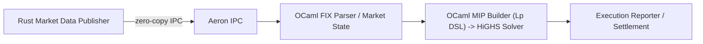

# AEA — Aeron Expressive Auction Prototype

A focused technical case study and prototype of a combinatorial auction clearing engine designed to eliminate legging risk in high-throughput, low-latency markets.

## Quick summary

- Project: AEA (Aeron Expressive Auction) Prototype
- Purpose: Treat order execution as an atomic combinatorial optimization to remove legging risk and maximize aggregate price improvement at batch auctions.
- Code anchors: `lib/matcher.ml` (OCaml solver wiring, constraints → MIP) and `rust-transport/src/main.rs` (market data publisher / prototype transport).
# AEA — Aeron Expressive Auction Prototype

Simple, fast, and atomic matching for multi-leg orders.

AEA models order execution as a single combinatorial optimization so multi-leg orders clear atomically. That removes legging risk and finds fills that maximize price improvement across participants.

Why this matters
- Legging risk: when legs execute separately, traders can be left exposed and markets can be gamed.
- AEA: treat the whole order as one optimization. Either all legs clear together, or none do.

Objective (what we maximize)

$$
\max \; \sum (Price_{Limit} - Price_{Exec}) \times Qty
$$

Price_{Exec} is the per-symbol clearing price candidate (prototype uses NBBO mid-price). Price_{Limit} is the leg's limit.

Architecture (diagram)



Note: the repo includes a prototype transport (`rust-transport/src/main.rs`) that uses a Unix datagram socket and JSON for fast iteration. Replace it with Aeron for zero-copy production paths.

How the solver works (short)
- Decision vars: binary x_b (execute bid) + continuous q_{b,l} (qty per leg).
- Constraints translated to linear form:
	- All-or-None: q_{b,l} = max_qty_{b,l} * x_b
	- MinNotional: sum(limit_price_l * q_{b,l}) >= min_notional * x_b
	- Ratio: q_num * den = q_den * num
- Objective: linear sum of (limit - clearing_price) * q. Implementation builds an Lp model in `lib/matcher.ml` and calls HiGHS.

Transport & performance notes
- Goal: microsecond predictability, minimal copies.
- Production transport: Aeron IPC for zero-copy shared-memory feeds.
- Mechanical sympathy: pin threads, isolate cores, preallocate buffers, avoid GC pressure in the hot path.

Why OCaml + Rust
- OCaml: concise, type-safe modeling of expressive auction logic; fast iteration on symbolic constraints.
- Rust: safe, low-level transport with deterministic control over memory and threads.

Future directions
- Incentive compatibility and strategyproof mechanisms (e.g., VCG-style or approximations).
- Defenses against manipulative patterns and tie-breaking strategies.
- Producing small audit certificates of feasibility and surplus for each clearing.

Try the prototype

```bash
# run the prototype NBBO publisher
cd rust-transport
cargo run --release
```

Build the OCaml matcher (dune/opam):

```bash
dune build
dune exec ./bin/matcher_main.exe -- <args>
```

Files to inspect
- `lib/matcher.ml` — MIP construction and solver interaction
- `rust-transport/src/main.rs` — prototype NBBO publisher (Unix datagram)

If you want this shortened further for a GitHub landing page or expanded into an operator runbook (Aeron setup, thread-affinity scripts), say which and I'll make it next.
